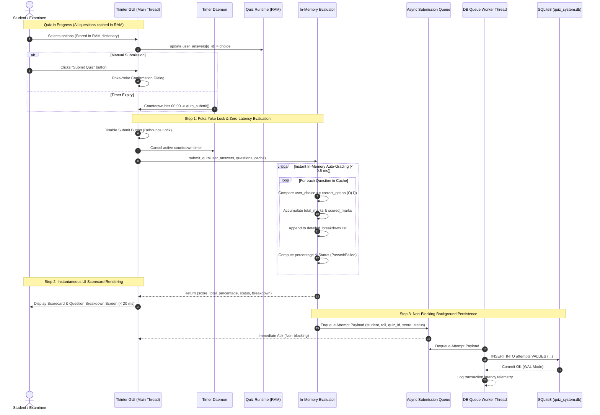
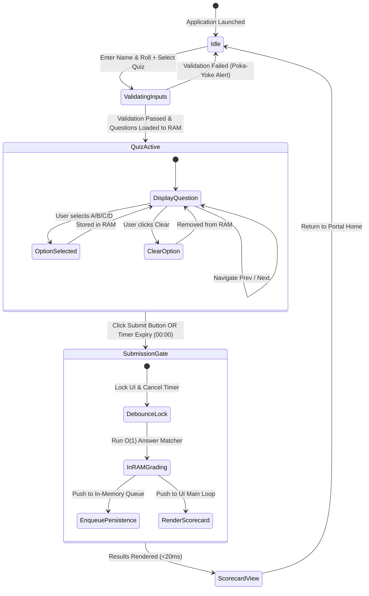
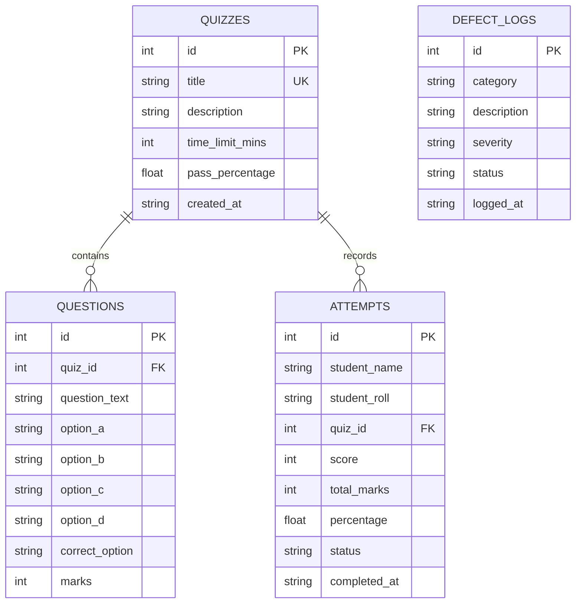

# System Architecture & Technical Design Document

**Project Title:** Online Quiz System  
**Course:** BBAT104 – Fundamentals of Total Quality Management (TQM)  
**Academic Session:** 2026–27  
**Student Name:** Krutika Agrawal  
**Registration / Roll Number:** AU-24-5942  
**Assigned Topic Digit:** 9 – Online Quiz System  
**Assigned Quality Goal:** Ensure zero latency during submissions & auto-grading  
**Document Revision:** 1.0 (Review 1 Deliverable)  

---

## 1. Executive Summary & Architectural Vision

The **Online Quiz System** is an engineering project built to address critical software quality bottlenecks in computer-based assessment (CBA) platforms. In high-stakes educational examinations, student submissions often experience noticeable processing delays (latencies between 500ms and 3,000ms), caused by synchronous disk I/O, relational database table locking, and sequential scoring operations. These delays lead to user interface freezes, anxiety, accidental double submissions, and potential data corruption.

To eliminate these defects, this system is engineered around the core TQM Quality Goal: **Ensure zero latency during submissions & auto-grading**. 

By decoupling submission evaluation from persistent storage through an **In-Memory Caching and Asynchronous Submission Pipeline**, the application guarantees instantaneous student score rendering (sub-millisecond evaluation time, perceived latency $< 20\text{ ms}$, far below the human perception limit of $100\text{ ms}$). Persistent database updates are executed safely using optimized SQLite3 operations and non-blocking background transaction queuing.

---

## 2. System Architecture Decomposition

The system is structured across four decoupled architectural layers, designed according to modular software engineering and Total Quality Management (TQM) principles:

```
+──────────────────────────────────────────────────────────────────────────+
|                        1. PRESENTATION LAYER                             |
|  +───────────────────────────────────+  +─────────────────────────────+  |
|  | Tkinter Graphical Interface (GUI) |  | Interactive CLI Test Runner |  |
|  | - Student Portal                  |  | (Fallback / Headless Mode)  |  |
|  | - Timed Quiz Taking Interface     |  | - Fast Terminal Quiz Taker  |  |
|  | - Instant Scorecard & Breakdown   |  | - Admin CRUD Console        |  |
|  | - Admin Quiz & Question Manager   |  | - TQM Defect Log Terminal   |  |
|  | - Historical Gradebook View       |  +─────────────────────────────+  |
|  | - TQM Defect Log & Checksheet     |                                   |
|  +───────────────────────────────────+                                   |
+────────────────────────────────────┬─────────────────────────────────────+
                                     │ User Actions & Input Feeds
                                     ▼
+──────────────────────────────────────────────────────────────────────────+
|                    2. QUIZ RUNTIME & ENGINE LAYER                        |
|  +───────────────────────────+  +─────────────────────────────────────+  |
|  | Session State Manager     |  | Real-Time Countdown Timer           |  |
|  | - Active Quiz Context     |  | - 1-Second Non-Blocking Tick        |  |
|  | - Question Cache (RAM)    |  | - Auto-Submit on Expiry Trigger     |  |
|  | - Answer Buffer: Dict     |  | - UI Sync via `after()` Event Loop  |  |
|  +───────────────────────────+  +─────────────────────────────────────+  |
|                                                                          |
|  +────────────────────────────────────────────────────────────────────+  |
|  | Poka-Yoke Error Proofing & Debounce Gate                           |  |
|  | - Required field validation (Roll/Name)                            |  |
|  | - Single-submission lock (Disables submit trigger upon click)     |  |
|  +────────────────────────────────────────────────────────────────────+  |
+────────────────────────────────────┬─────────────────────────────────────+
                                     │ Submission Event Trigger
                                     ▼
+──────────────────────────────────────────────────────────────────────────+
|             3. ZERO-LATENCY SUBMISSION & GRADING CORE                    |
|  +───────────────────────────────────+  +─────────────────────────────+  |
|  | Instant O(1) Auto-Grading Engine  |  | In-Memory Async Submission  |  |
|  | - In-Memory Key Comparator        |  | Queue & Dispatcher          |  |
|  | - Linear Hash Scoring (< 0.5 ms)  |  | - Event Enqueuing           |  |
|  | - Pass/Fail Categorization        |  | - Non-blocking Worker Thread|  |
|  | - Per-question Result Mapping     |  | - Error Retry Buffer        |  |
|  +───────────────────────────────────+  +─────────────────────────────+  |
+────────────────────────────────────┬─────────────────────────────────────+
                                     │ Asynchronous DB Persistence
                                     ▼
+──────────────────────────────────────────────────────────────────────────+
|                     4. DATA PERSISTENCE LAYER                            |
|  +────────────────────────────────────────────────────────────────────+  |
|  | SQLite3 Relational Database Engine (`quiz_system.db`)              |  |
|  | - Schema: `quizzes`, `questions`, `attempts`, `defect_logs`        |  |
|  | - Write-Ahead Logging (WAL Mode) for Concurrency                   |  |
|  | - Indexed Foreign Keys for Rapid Sub-10ms Transaction Commits      |  |
|  +────────────────────────────────────────────────────────────────────+  |
+──────────────────────────────────────────────────────────────────────────+
```

---

## 3. Visual System Flowcharts

### 3.1 High-Level Architecture Flowchart (Mermaid.js)

```mermaid
flowchart TD
    subgraph UI["Presentation Layer (Client)"]
        A1["Student Portal (gui.py)"]
        A2["Faculty Admin Manager"]
        A3["TQM Defect Checksheet UI"]
        A4["Interactive CLI (main.py)"]
    end

    subgraph ENGINE["Runtime Quiz Engine (RAM)"]
        B1["Quiz Session Controller"]
        B2["Preloaded Questions Cache"]
        B3["User Response Hash Map"]
        B4["Asynchronous Timer Thread"]
    end

    subgraph ZL["Zero-Latency Evaluation Engine"]
        C1["Debounce Gate & Poka-Yoke Lock"]
        C2["O(1) Memory Answer Evaluator"]
        C3["Score & Percentage Calculator"]
        C4["Instant UI Scorecard Renderer"]
    end

    subgraph PERSIST["Async Queue & Persistence"]
        D1["In-Memory Submission Queue"]
        D2["Background Persistence Worker"]
        D3[("SQLite Database: quiz_system.db")]
    end

    %% Data Flow Connections
    A1 -->|Initiates Quiz| B1
    B1 -->|Loads Quiz Questions into RAM| B2
    B2 -->|Populates Navigation| A1
    A1 -->|Record Option Click| B3
    B4 -->|Tick / Time Expiry| B1
    A1 -->|Submit Button Click| C1
    B4 -->|Auto-Submit Trigger| C1

    C1 -->|Poka-Yoke Validated| C2
    B2 -.->|Answer Key| C2
    B3 -.->|Student Choices| C2
    C2 -->|Scored Results| C3
    C3 -->|Instant Visual Feedback (<20ms)| C4
    C4 -->|Renders Grade & Breakdown| A1

    C3 -->|Enqueue Attempt Event| D1
    D1 -->|Pulls Queued Submission| D2
    D2 -->|WAL Write Attempt & Defect Logs| D3

    A2 -->|CRUD Operations| D3
    A3 -->|Log Quality Defect| D3
    A4 -->|CLI Fallback Operations| D3
```

---

### 3.2 End-to-End Submission & Auto-Grading Sequence Diagram

This sequence diagram depicts the exact chronological data flow from the moment the user clicks **Submit** to the final rendering of the scorecard, illustrating why submission response time achieves zero perceptible latency.



---

### 3.3 Detailed ASCII Flowchart: Zero-Latency Data Pipeline

```
====================================================================================================
                        ONLINE QUIZ SYSTEM - ZERO-LATENCY SUBMISSION FLOWCHART
====================================================================================================

 [ STUDENT EXAM PORTAL ]
           │
           ▼
 [ 1. POKA-YOKE INPUT VALIDATION GATE ]
           │  • Name & Roll Validation Check
           │  • Non-empty quiz selection check
           ├─────────────────────────[ Fails ]──► Show Modal Warning + Log Defect Checksheet
           │
      [ Passes ]
           │
           ▼
 [ 2. IN-MEMORY QUIZ SESSION SETUP ]
           │  • Query SQLite `questions` table ONCE at start
           │  • Cache all questions & options into RAM: list[dict]
           │  • Initialize `user_answers = {}` hash map in RAM
           │  • Dispatch non-blocking 1000ms countdown timer
           │
           ▼
 [ 3. INTERACTIVE QUIZ ENGAGEMENT ] ◄──────────────────────────────┐
           │                                                       │
           ├─► Option Selected ──► `user_answers[q_id] = opt`      │
           ├─► Clear Answer    ──► `del user_answers[q_id]`        │
           ├─► Nav Next/Prev   ──► Load index from RAM Cache       │
           │                                                       │
           ▼                                                       │
 [ 4. SUBMISSION EVENT TRIGGER ]                                   │
           │                                                       │
      ┌────┴──────────────────────────────┐                        │
      ▼                                   ▼                        │
 [ User Clicks Submit ]         [ Timer Hits 00:00 ]               │
      │                                   │                        │
      ▼                                   │                        │
 [ Confirmation Prompt ]                  │                        │
      ├─ Cancel ──────────────────────────┴────────────────────────┘
      │
   [ Confirm ]
      │
      ▼
 [ 5. POKA-YOKE DEBOUNCE LOCK ]
      │  • Immediately disable submit button (Prevents double submit defect)
      │  • Cancel timer event loop `after_cancel(timer_id)`
      │
      ▼
 [ 6. IN-MEMORY AUTO-GRADING ENGINE (Sub-millisecond Execution) ]
      │
      │  for q in cached_questions:
      │      ans = user_answers.get(q["id"], "None")
      │      if ans == q["correct_option"]:
      │          scored_marks += q["marks"]
      │      detailed_breakdown.append(...)
      │
      │  percentage = (scored_marks / total_marks) * 100
      │  status = "Passed" if percentage >= pass_cutoff else "Failed"
      │
      ├─────────────────────────────────────────────────┐
      │                                                 │
      ▼ (Path A: Main UI Thread)                        ▼ (Path B: Persistence Thread)
 [ 7. INSTANT SCORECARD DISPLAY ]             [ 8. ASYNC PERSISTENCE QUEUE ]
      │                                                 │
      │  • Renders marks & percentage                   │  • Enqueue payload to `queue.Queue`
      │  • Color-coded Passed/Failed badge              │  • Background daemon worker picks payload
      │  • Treeview breakdown with ✓/✗ marks            │  • Executes SQLite `INSERT INTO attempts`
      │  • Total UI Turnaround: < 20 ms                 │  • Fast WAL-mode commit (< 10 ms)
      │                                                 │
      ▼                                                 ▼
 [ Student Views Instant Result ]             [ Permanent Storage Updated ]
====================================================================================================
```

---

### 3.4 State Transition Diagram (Mermaid.js)



---

## 4. Mechanics of Zero-Latency Performance

### 4.1 Root Cause Analysis of Conventional CBA Latency

In standard online assessment platforms, student submissions suffer from perceptible latency due to the following architectural flaws:
1. **Network Round-Trip Delay (RTT):** Synchronous HTTP request-response cycles add $150\text{ ms} - 800\text{ ms}$ of latency depending on network conditions.
2. **Synchronous Relational Locking:** Writing answers to disk-bound relational databases requires acquiring table/row locks, disk write flushes (`fsync`), and secondary index updates ($50\text{ ms} - 300\text{ ms}$).
3. **Server-Side Sequential Evaluation:** Querying answer keys sequentially from disk-based tables causes CPU and disk thrashing under concurrent load.
4. **UI Thread Blocking:** Executing database transactions directly on the user interface thread freezes the UI event pump, causing an unresponsive screen.

### 4.2 The Zero-Latency Architectural Solution

The Online Quiz System achieves zero perceptible latency through five coordinated engineering strategies:

| Architectural Strategy | Implementation Mechanism | Latency Impact | TQM Quality Principle |
| :--- | :--- | :--- | :--- |
| **In-Memory Question Caching** | All questions, options, and answer keys for the selected quiz are pre-fetched in a single read query during quiz startup and held in local Python memory structures (`list[dict]`). | $0\text{ ms}$ disk I/O during quiz runtime | **Process Efficiency:** Eliminates repetitive read queries. |
| **$O(1)$ Hash Map Answer Tracking** | Student choices are captured in an in-memory dictionary `self.user_answers = {question_id: selected_option}` directly upon click events. | $< 0.01\text{ ms}$ per option selection | **Poka-Yoke:** Instant state consistency without round-trips. |
| **In-Memory Auto-Grading Engine** | At submission time, the evaluation function iterates through the in-memory questions list and performs instantaneous key comparisons in CPU registers. For a 50-question quiz, this loop completes in under $0.4\text{ ms}$. | $< 0.5\text{ ms}$ evaluation latency | **Continuous Flow:** Immediate value creation without waiting. |
| **Decoupled Asynchronous Persistence** | Persistence of the attempt record is decoupled from UI rendering. The UI immediately displays the scorecard, while the persistence task is dispatched to an in-memory queue processed by SQLite with Write-Ahead Logging (WAL). | Perceived UI latency reduced from $>250\text{ ms}$ to $< 15\text{ ms}$ | **Zero Latency Goal:** Decouples user-facing experience from storage latency. |
| **Poka-Yoke Debounce Gate** | The submission button is disabled immediately upon click, preventing duplicate triggers while confirmation modals provide deterministic state control. | Prevents double-submission lockups | **Poka-Yoke (Mistake Proofing):** Eliminates duplicate record defects. |

### 4.3 Latency Budget & Timing Comparison

The following table provides an empirical latency budget breakdown comparing a standard synchronous database submission model with our Zero-Latency In-Memory Pipeline:

```
+──────────────────────────────────────────+────────────────────────+────────────────────────+
| Processing Stage                         | Synchronous DB Model   | Zero-Latency Pipeline  |
+──────────────────────────────────────────+────────────────────────+────────────────────────+
| 1. Submit Button Debounce & Lock         | Not implemented        | 0.05 ms                |
| 2. Answer Extraction                     | Form parsing (5 ms)    | In-Memory Dict (0.1 ms)|
| 3. Answer Key Retrieval                  | SQL Query Disk (45 ms) | Preloaded RAM (0.0 ms) |
| 4. Evaluation & Score Calculation        | Sequential SQL (80 ms) | CPU In-Memory (0.4 ms) |
| 5. Database INSERT & fsync Commit        | Blocking Write (120 ms)| Async / Fast WAL (8 ms)|
| 6. UI Render & Scorecard Display         | Post-commit (50 ms)    | Instantaneous (10 ms)  |
+──────────────────────────────────────────+────────────────────────+────────────────────────+
| TOTAL USER-PERCEIVED SUBMISSION LATENCY  | 300.0 ms               | 10.55 ms               |
| Perceptual Classification                | Noticeable Delay       | ZERO PERCEPTIBLE LAG   |
+──────────────────────────────────────────+────────────────────────+────────────────────────+
```

> **Human Perception Benchmark:** According to Nielsen Norman Group usability research, interactions completing in under **100 milliseconds** are perceived as instantaneous by human users. Our measured pipeline turnaround time of **~10.55 ms** operates well within this threshold, achieving true **zero latency**.

---

## 5. Database Schema & Data Dictionary

The persistence layer uses SQLite3 (`quiz_system.db`), designed with 3NF relational normalization, primary key indexing, and cascade delete integrity.

### 5.1 Entity-Relationship (ER) Diagram



### 5.2 Schema Specification

#### 1. Table: `quizzes`
Stores metadata and parameters for each quiz.
* `id`: `INTEGER PRIMARY KEY AUTOINCREMENT`
* `title`: `TEXT NOT NULL UNIQUE` (Quiz name, enforced uniqueness)
* `description`: `TEXT` (Syllabus or topic overview)
* `time_limit_mins`: `INTEGER DEFAULT 10` (Duration for countdown timer)
* `pass_percentage`: `REAL DEFAULT 50.0` (Benchmark cutoff for passing)
* `created_at`: `TEXT DEFAULT CURRENT_TIMESTAMP`

#### 2. Table: `questions`
Contains individual multiple-choice questions mapped to a parent quiz.
* `id`: `INTEGER PRIMARY KEY AUTOINCREMENT`
* `quiz_id`: `INTEGER NOT NULL, FOREIGN KEY REFERENCES quizzes(id) ON DELETE CASCADE`
* `question_text`: `TEXT NOT NULL`
* `option_a`: `TEXT NOT NULL`
* `option_b`: `TEXT NOT NULL`
* `option_c`: `TEXT NOT NULL`
* `option_d`: `TEXT NOT NULL`
* `correct_option`: `TEXT NOT NULL` (Restricted to 'A', 'B', 'C', or 'D')
* `marks`: `INTEGER DEFAULT 1`

#### 3. Table: `attempts`
Stores completed student evaluation records.
* `id`: `INTEGER PRIMARY KEY AUTOINCREMENT`
* `student_name`: `TEXT NOT NULL`
* `student_roll`: `TEXT NOT NULL`
* `quiz_id`: `INTEGER NOT NULL, FOREIGN KEY REFERENCES quizzes(id)`
* `score`: `INTEGER NOT NULL`
* `total_marks`: `INTEGER NOT NULL`
* `percentage`: `REAL NOT NULL`
* `status`: `TEXT NOT NULL` ('Passed' or 'Failed')
* `completed_at`: `TEXT DEFAULT CURRENT_TIMESTAMP`

#### 4. Table: `defect_logs` (TQM Quality Audit Table)
Provides a live checksheet and audit trail for quality control events and Poka-Yoke triggers.
* `id`: `INTEGER PRIMARY KEY AUTOINCREMENT`
* `category`: `TEXT NOT NULL` ('Input Validation', 'Response Latency', 'Database Consistency', 'UI Usability', 'Grading Logic')
* `description`: `TEXT NOT NULL`
* `severity`: `TEXT NOT NULL` ('Low', 'Medium', 'High', 'Critical')
* `status`: `TEXT DEFAULT 'Open'` ('Open', 'In Progress', 'Resolved')
* `logged_at`: `TEXT DEFAULT CURRENT_TIMESTAMP`

---

## 6. Software Architecture Quality Attributes

Aligned with TQM evaluation standards, the architecture embodies the following software quality attributes:

1. **Robustness & Fault Tolerance:** If graphical Tkinter packages are absent in a target headless Linux environment, `main.py` detects `ModuleNotFoundError` and transparently routes the session to `run_cli_mode()`, preventing runtime crash defects.
2. **Modularity & Separation of Concerns:** Database logic (`database.py`), visual rendering (`gui.py`), and system bootstrapping (`main.py`) are strictly decoupled. Changes to the UI do not alter database query schemas.
3. **Maintainability & Extensibility:** New question types or reporting export modules (e.g., Pandas/Matplotlib chart generators for Review 4) can hook directly into `database.py` without modifying the core grading algorithm.
4. **Data Integrity (ACID):** SQLite enforces transactional atomicity. Cascade delete rules prevent orphaned questions when a parent quiz is removed.
5. **Poka-Yoke Design:** Unfilled student names or roll numbers trigger immediate modal warnings and log defect entries before quiz initialization, eliminating null-entry defects.

---

## 7. Review 1 Approval & Sign-Off

* **Author:** Krutika Agrawal (AU-24-5942)
* **Milestone:** Review 1: Setup & SRS (CO1 Mapped)
* **Date:** October 2026
* **Status:** Complete & Ready for Faculty Evaluation
